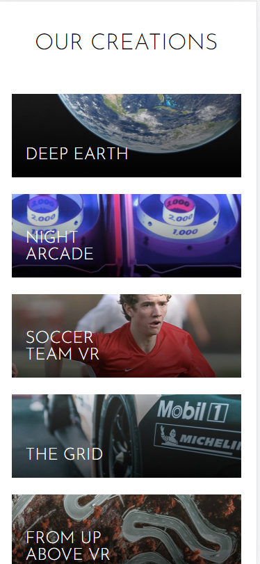
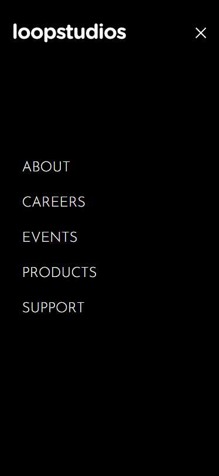

# Frontend Mentor - Loopstudios landing page solution

This is a solution to the [Loopstudios landing page challenge on Frontend Mentor](https://www.frontendmentor.io/challenges/loopstudios-landing-page-N88J5Onjw). Frontend Mentor challenges help you improve your coding skills by building realistic projects.

## Table of contents

- [Overview](#overview)
  - [The challenge](#the-challenge)
  - [Screenshot](#screenshot)
  - [Links](#links)
- [My process](#my-process)
  - [Built with](#built-with)
  - [What I learned](#what-i-learned)
  - [Continued development](#continued-development)
- [Author](#author)

## Overview

### The challenge

Users should be able to:

- View the optimal layout for the site depending on their device's screen size
- See hover states for all interactive elements on the page

### Screenshot

### Links

- Solution URL: [Add solution URL here](https://github.com/Kijimai/loopstudios-react)
- Live Site URL: [Add live site URL here](https://loopstudios-react-kijimai.netlify.app/)

## My process

### Built with

- Semantic HTML5 markup
- CSS custom properties
- Flexbox
- Mobile-first workflow
- [React](https://reactjs.org/) - JS library

### What I learned

Probably one of the most challenging designs I've picked up recently. On top of practicing with react, I struggled heavily with the navigation bar trying to make it fully responsive. I had to make 5 different iterations before I got to the one in my solution. It was only until I really had to leverage the utility of react that I found my solution to be the best of all my tries. For whatever reason it took me far too long to realize that react's conditional rendering would save me the trouble of wrestling with the css to make the same code fully responsive.

Nevertheless, I absolutely came out of this learning a ton about what I could do with reactJS as well as css!

### Continued development

I certainly need to utilize react's powerful mechanisms of conditional rendering in future projects to make my life easier.

## Author

- Website - [My Website](https://jdbucog.com/)
- Frontend Mentor - [@Kijimai](https://www.frontendmentor.io/profile/Kijimai)
